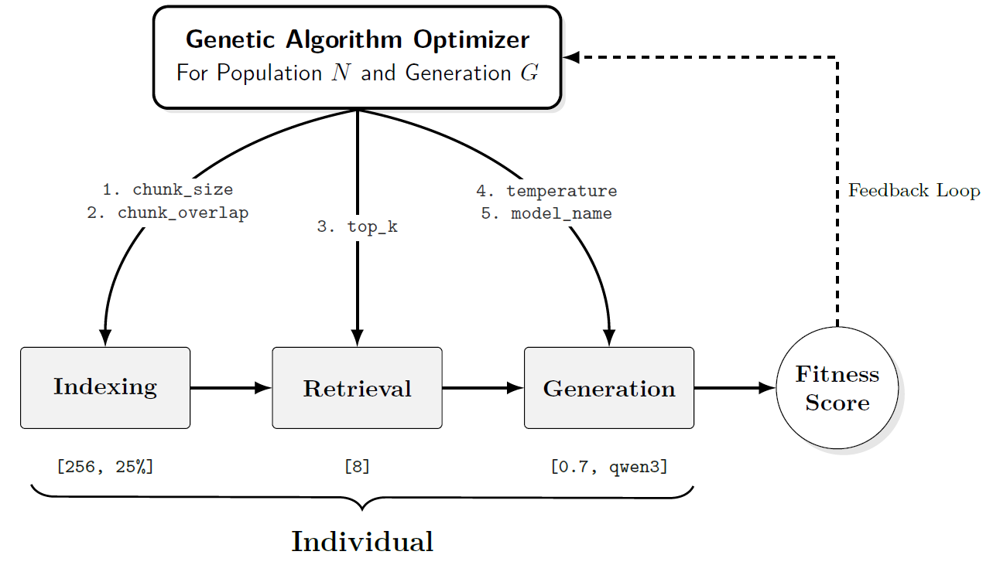

# Resource-Aware RAG HPO

Evolutionary hyperparameter optimization for resource-aware Naive-RAG pipelines in technical manufacturing knowledge access.

This repository accompanies the under-review manuscript **"Evolutionary Hyperparameter Optimization of Resource-Aware Naive-RAG Pipelines for Technical Knowledge Access in Manufacturing"**. It provides a curated, reproducible implementation for configuring local open-weight RAG systems under quality and latency constraints.

## Executive Summary

Manufacturing teams depend on technical documentation for maintenance, troubleshooting, process support, and operator assistance. RAG systems can make that knowledge accessible through natural language, but their performance depends on interacting choices across retrieval, chunking, model selection, and decoding.

This project treats RAG configuration as an engineering optimization problem. A genetic algorithm searches the mixed hyperparameter space and evaluates each candidate end to end using factual correctness.

Key findings from the study:

- Average fitness increased by approximately **80%** over the initial random population.
- The evolutionary search evaluated **152 unique configurations**.
- This corresponds to **more than 99% fewer evaluations** than exhaustive grid search over the defined space.
- Compact local models achieved **86% of the maximum observed quality** while requiring only **7% of the inference time** of the best-performing configuration.

## Architecture



The workflow combines:

- local Ollama models for generation, judging, and embeddings;
- Chroma vector stores for retrieval;
- Ragas factual correctness for automated evaluation;
- DEAP-based evolutionary search with elitism and early stopping;
- analysis notebooks for quality, latency, search convergence, and parameter importance.

## Repository Layout

```text
configs/              Central runtime configuration
docs/                 Methodology, data, reproduction, and attribution notes
notebooks/            Curated analysis notebooks
results/figures/      Selected publication figures
results/samples/      Lightweight result samples
src/evo_rag_hpo/      Reusable Python package
tests/                Unit and import tests
```

Legacy working folders such as `Paper-Plotts/`, `BackUp/`, `icme/`, and submission artifacts are intentionally excluded from public Git tracking.

## Quick Start

Create the environment:

```bash
conda env create -f environment.yml
conda activate evo-rag
```

Install Ollama and pre-pull the configured models:

```bash
ollama pull embeddinggemma:300m
ollama pull qwen3-coder:30b
```

Build vector stores from licensed local documents:

```bash
python -m evo_rag_hpo.index --config configs/default.yaml
```

Run the optimization:

```bash
python -m evo_rag_hpo.optimize --config configs/default.yaml
```

Evaluate a single genotype:

```bash
python -m evo_rag_hpo.evaluate 1 2 6 0 3 --config configs/default.yaml
```

## Reproduction Levels

**Smoke test:** run the unit tests and import checks without local LLM inference.

```bash
python -m compileall src
pytest
```

**Sample analysis:** inspect the lightweight samples in `results/samples/` and selected figures in `results/figures/`.

**Full artifact reproduction:** requires licensed technical documents, the evaluation set, Ollama, the configured local models, and the full experimental CSV artifacts. The full artifacts will be released through Zenodo or a GitHub Release after paper clearance.

## Data Availability

This public repository intentionally does not redistribute third-party technical manuals or large experimental logs. The documented strategy is:

- keep code, configuration, selected figures, and small samples in GitHub;
- release large CSV artifacts and data descriptors through Zenodo or a GitHub Release after review clearance;
- require users to verify licenses for any source documents they process locally.

See [docs/data-availability.md](docs/data-availability.md).

## Model Attribution

The experiments use local open-weight models served through Ollama. Model weights are not distributed in this repository and remain governed by their respective upstream licenses. Users must verify model licenses before operational use.

See [docs/model-attribution.md](docs/model-attribution.md).

## Citation

Citation information will be added after publication. Until then, cite this repository as a research artifact for the under-review manuscript.

## License

Code and documentation are released under the Apache License 2.0. Data and model weights are subject to separate upstream licenses and availability constraints.

