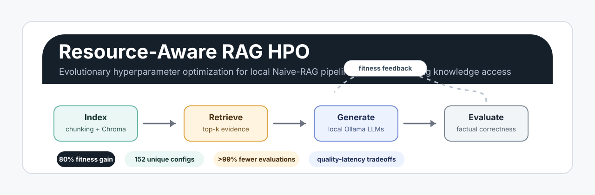
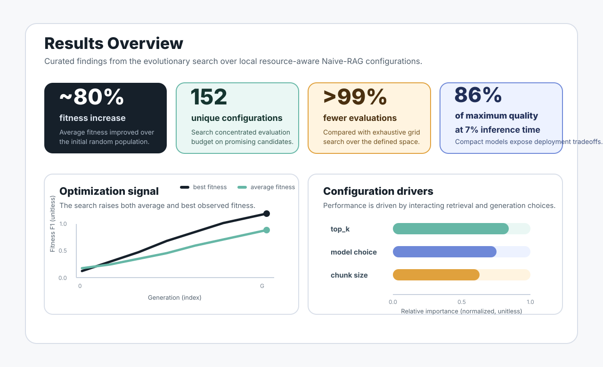
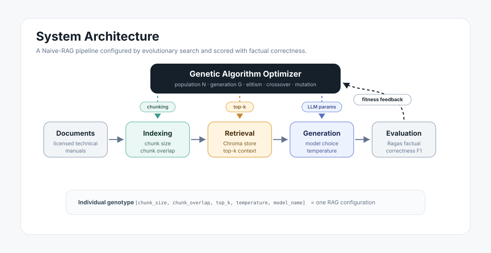

<p align="center">
  
</p>

<p align="center">
  <a href="https://github.com/Adam-yes/resource-aware-rag-hpo/actions/workflows/ci.yml"></a>
  
  
  
  
</p>

<p align="center">
  <b>Evolutionary hyperparameter optimization for resource-aware Naive-RAG pipelines in technical manufacturing knowledge access.</b>
</p>

<p align="center">
  RAG configuration is a costly mixed-integer engineering problem: chunking, retrieval depth, decoding, and model choice interact in ways that directly affect quality, latency, and local compute cost. This project applies evolutionary search to find resource-aware Naive-RAG configurations and documents the trade-offs a technical leader would need before deploying such a system.
</p>

<p align="center">
  <a href="#why-it-matters">Why it matters</a> |
  <a href="#results-at-a-glance">Results</a> |
  <a href="#quick-start">Quick start</a> |
  <a href="#reproduce-the-study">Reproduce</a> |
  <a href="docs/DESIGN.md">Design</a> |
  <a href="docs/RESULTS.md">Results</a>
</p>

---

## Why It Matters

Manufacturing teams rely on technical documentation for maintenance, troubleshooting, process support, and operator assistance. Retrieval-augmented generation can make that knowledge accessible through natural language, but real-world quality depends on interacting choices across retrieval, chunking, model selection, and decoding.

This repository turns RAG configuration into an engineering optimization problem: a genetic algorithm searches the mixed hyperparameter space and evaluates each candidate end to end using factual correctness.

The repository is built to enable a **faithful 1:1 reproduction** of the manuscript. The computational path - splitter, prompt, fixed context window, fitness aggregation, and the average-fitness early-stopping rule - is pinned to the published behavior; engineering additions (packaging, config, validation, tests, CI) are deliberately behavior-preserving. See [docs/improvement-audit.md](docs/improvement-audit.md) for the explicit fidelity decisions.

> This repository accompanies the under-review manuscript **"Evolutionary Hyperparameter Optimization of Resource-Aware Naive-RAG Pipelines for Technical Knowledge Access in Manufacturing"**.

For the architectural reasoning behind the project, read [docs/DESIGN.md](docs/DESIGN.md). For the durable results summary, read [docs/RESULTS.md](docs/RESULTS.md). For decision records, see [docs/adr/](docs/adr/).

## Results At A Glance

<p align="center">
  
</p>

## Paper Figures

The README uses a custom results overview so the public landing page keeps consistent typography and visual scale. The original paper figures remain available as full-size artifacts:

| Figure | What it shows |
| --- | --- |
| [Optimization convergence](results/figures/Konvergenz_Max_Avg.png) | Average and maximum fitness over generations |
| [Quality-latency tradeoff](results/figures/max_fit_vs_latency.png) | Fitness versus inference-time behavior |
| [Feature importance](results/figures/Feature_Importance_Random_Forest.png) | Relative influence of core RAG hyperparameters |
| [Interaction heatmap](results/figures/heatmap_f1_temp_chunk_top.png) | Interaction between retrieval depth, chunking, and temperature |
| [Model clusters](results/figures/model_cluster.png) | Grouping of model behavior in the search results |
| [Top-k distribution](results/figures/Top_k_distribution.png) | Evolutionary concentration over retrieval depth |
| [Original method schematic](results/figures/Hyperparameter_Optimierung_Methode.png) | Paper-native schematic retained as a full-size artifact |

## System Architecture

<p align="center">
  
</p>

The workflow combines:

- **Local inference:** Ollama models for generation, judging, and embeddings.
- **Retrieval:** Chroma vector stores over licensed technical documents.
- **Evaluation:** Ragas factual correctness as the automated fitness signal.
- **Search:** DEAP-based genetic optimization with elitism and early stopping.
- **Analysis:** notebooks for convergence, latency, parameter importance, and model clusters.

## Repository Map

```text
configs/              Central runtime configuration
docs/                 Methodology, data, reproduction, and attribution notes
notebooks/            Curated analysis notebooks
results/figures/      Selected publication figures
results/samples/      Lightweight result samples
src/evo_rag_hpo/      Reusable Python package
tests/                Unit and import tests
```

Legacy working folders, submission files, raw manuals, local vector stores, and full experiment logs are intentionally excluded from public Git tracking.

## Quick Start

Create the environment:

```bash
conda env create -f environment.yml
conda activate evo-rag
```

Install Ollama and pre-pull the configured models:

```bash
ollama pull embeddinggemma:300m
ollama pull qwen3-coder:30b
```

Run the workflow:

```bash
python -m evo_rag_hpo.index --config configs/default.yaml
python -m evo_rag_hpo.optimize --config configs/default.yaml
python -m evo_rag_hpo.evaluate 1 2 6 0 3 --config configs/default.yaml
```

Use `python -m evo_rag_hpo.index --config configs/default.yaml --force` when an existing local Chroma collection should be rebuilt instead of resumed.

## Reproduce The Study

| Level | Goal | Command or artifact |
| --- | --- | --- |
| Smoke test | Validate package imports and lightweight contracts | `python -m compileall src && python -m unittest discover -s tests` |
| Engineering check | Run the publication-quality local gate | `make check` |
| Sample analysis | Inspect public samples and selected figures | `results/samples/`, `results/figures/` |
| Full artifact | Re-run the complete optimization loop | Requires licensed source documents, evaluation set, Ollama, configured models, and full CSV artifacts |

Full experimental artifacts are intended for Zenodo or GitHub Release publication after paper clearance.

## Public Interfaces

```bash
python -m evo_rag_hpo.index      # build Chroma vector stores
python -m evo_rag_hpo.optimize   # run evolutionary optimization
python -m evo_rag_hpo.evaluate   # evaluate a single genotype
```

The central runtime configuration is [configs/default.yaml](configs/default.yaml).

Core runtime behavior is explicit in the YAML file: model choices, the search space, the fixed context window (`num_ctx`), keep-alive values, NaN handling, the average-fitness early-stopping criterion, and output paths. The defaults reproduce the published experiment exactly.

## Data And Model Policy

This repository does **not** redistribute third-party technical manuals, model weights, local vector databases, or large experiment logs.

- Data availability: [docs/data-availability.md](docs/data-availability.md)
- Model attribution: [docs/model-attribution.md](docs/model-attribution.md)
- Reproduction guide: [docs/reproduction.md](docs/reproduction.md)
- Improvement audit: [docs/improvement-audit.md](docs/improvement-audit.md)
- Roadmap: [ROADMAP.md](ROADMAP.md)

## Repository Metadata

Recommended GitHub metadata setup:

```bash
gh repo edit Adam-yes/resource-aware-rag-hpo \
  --description "Resource-aware evolutionary HPO for local Naive-RAG pipelines in manufacturing" \
  --homepage "https://github.com/Adam-yes/resource-aware-rag-hpo" \
  --add-topic rag \
  --add-topic retrieval-augmented-generation \
  --add-topic genetic-algorithm \
  --add-topic hyperparameter-optimization \
  --add-topic ollama \
  --add-topic langchain \
  --add-topic manufacturing \
  --add-topic ragas \
  --add-topic resource-aware-ai
```

## Author And Portfolio

This repository is designed as a public research-software artifact and as part of a broader engineering portfolio. The reusable presentation pattern is: outcome-first README, compact architecture visuals, explicit design trade-offs, ADRs, reproducibility policy, and visible CI/test discipline.

## Citation

Citation information will be added after publication. Until then, cite this repository as a research artifact for the under-review manuscript.

## License

Code and documentation are released under the Apache License 2.0. Data and model weights are subject to separate upstream licenses and availability constraints.
